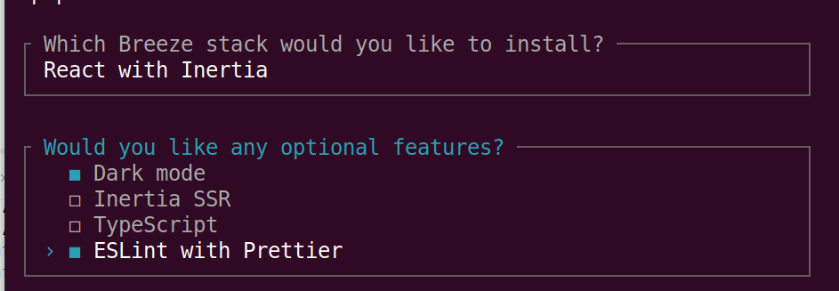

# Instalación

# Instalando inertia con react

# Actualizamos tailwind a versión 4

# Copiamos del proyecto anterior:
* Script local
* Las pseudovariables de tailwond para nuestros layout
* Agregamos todo y actualizamos en app.css
* Instalamos daisy
* Modificamos también vite.config.js

# Lanzamos el proyecto y vemos que funciona con auth

* Ejecutamos las migraciones

