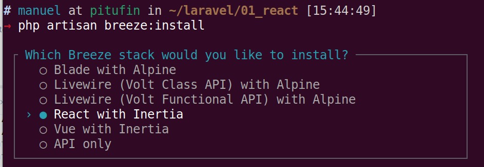

# Instalación

# Instalando inertia con react

#Actualizamos tailwind a versión 4

#Copiamos del proyecto anterior:
script local
Las pseudovariables de tailwond para nuestros layout
agregamos todo y actualizamos en app.css
instalamos daisy
modificamos también vite.config.js

#LAnzamos el proyecto y vemos que funciona con auth
ejecutamos las migraciones

